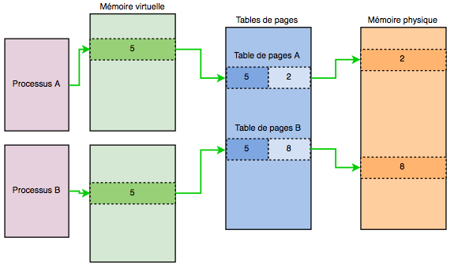
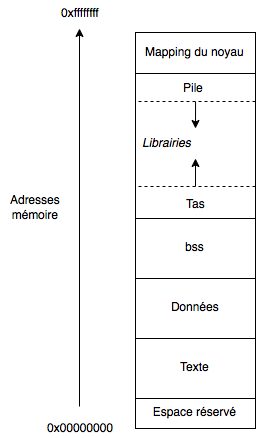

# Gestion de la memoire
https://beta.hackndo.com/memory-allocation/

### Memory mapping 
les process ont besoin de memoire, partager directement la memoire physic entre
    est un enfer, donc le noyaux, creer un back a sable, qui leurs donne des page de memoire
    en leurs faisant croire qu'il n'y a que eu sur la machine.
    chaque program a sa page -> tables des pages -> memoir physique
    
    
### Memory segmentation
Ces address de la memoire sont segmenter avec les differente session :
    1. text
    2. data
    3. bss
    //
    1. heap
    2. pile
    
    
#### Section .text
* c'est la ou est le code, une fois cette partit creer, on ne peut plus la changer
  si je veux la modifier -> Segmentation fault.
* Taille fix, lit les intructions une par une

#### Section .data, .bss
* Stock les variables global et static du program,
* les donne initialisees sont dans data,
* les autres sont dans bss
* la taille est fixe, et c'est car les variables sont dans ces zones
  qu'elle peuvent persister tout le long du program.

```c
int global -> bss
char global1 = 'c' -> bss
int main() 
{
    static int ex = 10; -> data
}
```
    
### Le heap (tas)
* Cette zone est manipulable par le programmeur,
* elle n'a pas de taille fix,
* elle contient les malloc / calloc 
* plus la taille augmentent, 
  plus on se raproche des address memoire de la pile.
  il y a donc une limit
* on peut acceder a ces ptr depuis n'import ou dans le programme,
  ptr -> acces moins rapide
 
### la stack
* taille variable vas vers le haut de la pile
* stock les variables des fonctions,
* stock le stack frame: zone memoire dans la pile ou sont toutes les 
  informations necessaires a l'appelle de la function


### les Registres
* rax (accumulateur), rbx (base), rcx (compteur), rdx (data)
  stock des donees temporaire pour le proc
  
* rsp (stack ptr), rbp (base ptr), rsi (source index), rdi (destination ptr)
  ptr et index, rsp et rbp stock le stack frame courant.

* registre rip (intruction ptr), address de la prochaine instruction

* registre EFLAGS, contient des indicateurs.
