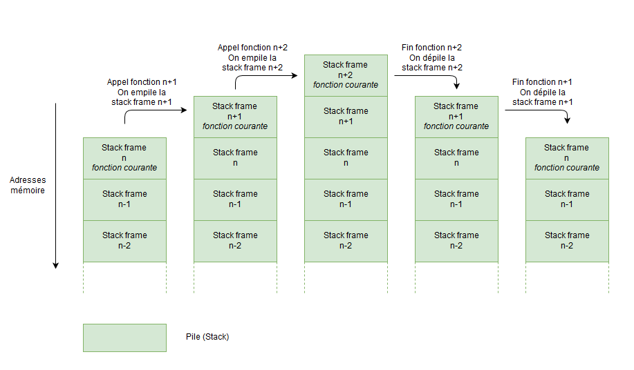
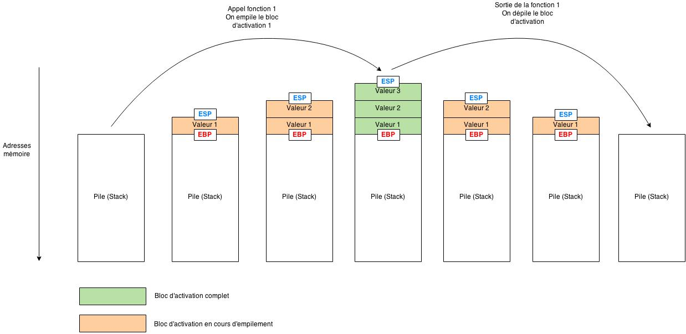

# Fonctionnement de la pile
by Pixis
https://beta.hackndo.com/stack-introduction

## Intro
la pile a une struct LIFO, Last In, Last Out.
C'est comme une pile d'assiette, 
mais a l'envers car la stack empile par le bas.
Ce que l'on appelle le haut de la stack, 
c'est le bas, et plus on empile, et plus les address diminuent.

## StackFrame
C'est smart: quand on appelle une fonction, toutes les donnes necessaires
sont empile sur ceux pour revenir a l'etat initial.
Il suffit juste de depiler pour revenir a avant le call de la function.



* rsp garde en memoire le haut de la pile, il est mis a jour a chaque
  execution
* rbp garde en memoire le debut de la stack frame

* rbp -> stackFrame -> rsp




## Prologue - Epilogue
the program
```c
int response(int a, int b, int c)
{
	return a+b+c;
}

int main()
{
	int result;
    result = response(4, 8, 42);
}
```
the main function
```asm
    0x080483a5 <+0>:     push   ebp
    0x080483a6 <+1>:     mov    ebp,esp
    0x080483a8 <+3>:     sub    esp,0x1c
    0x080483ab <+6>:     mov    DWORD PTR [esp+0x8],0x2a
    0x080483b3 <+14>:    mov    DWORD PTR [esp+0x4],0x8
    0x080483bb <+22>:    mov    DWORD PTR [esp],0x4
    0x080483c2 <+29>:    call   0x8048394                   ; response
    0x080483c7 <+34>:    mov    DWORD PTR [ebp-0x4],eax     ; 
    0x080483ca <+37>:    leave
    0x080483cb <+38>:    ret
```
avant de call response, on fill les trois arguments avec du dernier au premier
avec les 3 lines precedentes, ce qui donne:
* la pile grandit vers les address basse! 
  le premier sera plus petit que le precedent
```shell script
(gdb) x/8xw $esp
0xbffffc9c:    0x00000004    0x00000008    0x0000002a    0x080483eb
0xbffffcac:    0xb7fd6ff4    0x080483e0    0x00000000    0xbffffd38
```

on rentre dans la function
mais avant on a push rip pour connaitre la prochaine instruction une fois
la function terminer.
```shell script
call <addresse de la function> ==  
push EIP
jmp <adresse de la fonction>
```

print de la stack
```shell script
(gdb) stepi
0x08048394 in reponse ()

(gdb) x/8x $esp
    0xbffffc98:  esp ->  0x080483c7    0x00000004    0x00000008    0x0000002a <- rbp
    0xbffffca8:    0x080483eb    0xb7fd6ff4    0x080483e0    0x00000000
```


Fonction response
ebp est pousser sur la stack frame ( is contient la next instruction) ,
ebp prend la meme valuer que rsp car il n'y a rien dedans
```asm
    0x08048394 <+0>:    push   ebp              ; prologue
    0x08048395 <+1>:    mov    ebp,esp          ; prologue
    0x08048397 <+3>:    mov    eax,DWORD PTR [ebp+0xc]
    0x0804839a <+6>:    mov    edx,DWORD PTR [ebp+0x8]
    0x0804839d <+9>:    lea    eax,[edx+eax*1]
    0x080483a0 <+12>:   add    eax,DWORD PTR [ebp+0x10]
    0x080483a3 <+15>:   pop    ebp
    0x080483a4 <+16>:   ret
```
line 1 : save rbp, il a ete push par le call
line 2 : ebp prend la valeur de esp, car les deux functions sont les meme.


